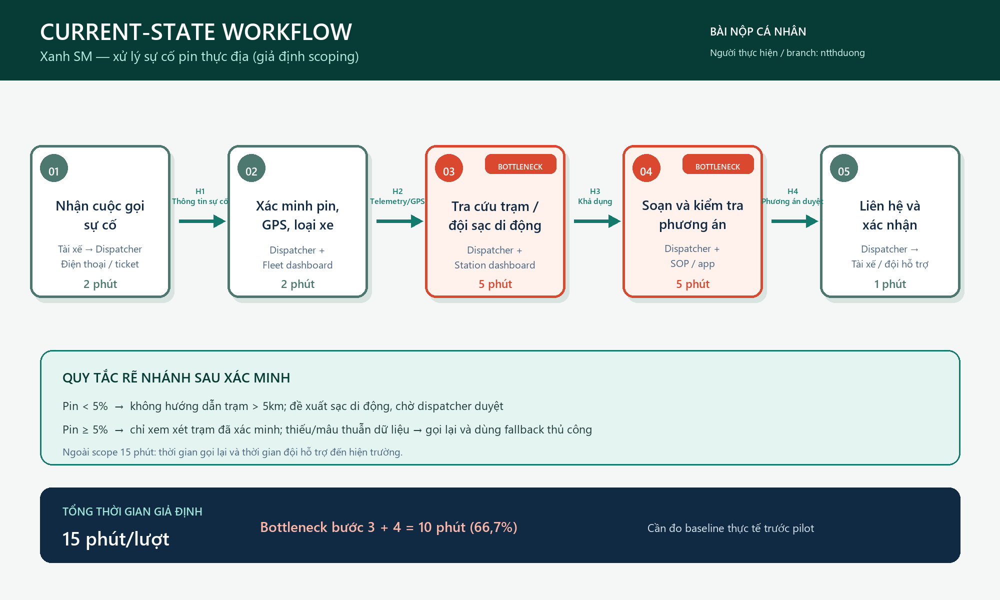
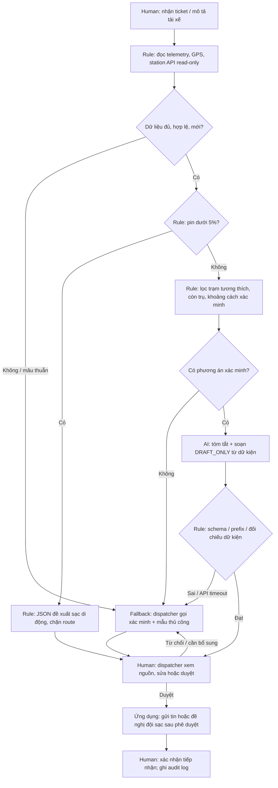

> **Tên nhóm:** WonderWomen  
> **Thành viên tham gia:**  
> - Ngô Hoành Thụy Khuê — 26ai.khuenht@vinuni.edu.vn — Nhóm trưởng
> - Nguyễn Thị Thùy Dương — 26ai.duongntt@vinuni.edu.vn
> - Phan Thị Khánh Linh — 26ai.linhptk@vinuni.edu.vn
> - Nguyễn Ngọc Linh — 26ai.linhnn@vinuni.edu.vn
> - Nguyễn Thị Hạ — 26ai.hant@vinuni.edu.vn

# 02 — Deep Dive: Xanh SM Battery Incident Co-pilot

## 1. Scope, nguồn và giả định

Bài làm theo `01-worksheet.md`, `README.md` và slide **Day 02_ AI Product Lab.pdf**. Chọn Card #1 trong [Problem Scan](01-problem-scan.md). Bối cảnh Vin Smart Future được dùng theo đề bài; chưa xác minh cơ cấu tổ chức hay quy trình nội bộ thực tế.

**Scope prototype:** một lượt mô tả sự cố → một phản hồi nháp hoặc JSON đề xuất → kiểm tra ranh giới. Không tích hợp telemetry, bản đồ, gửi tin hoặc điều xe thực. Model chuyển từ Gemini 2.5 Flash trong đề sang **`gemini-3.6-flash` theo yêu cầu dùng phiên bản mới hơn**, sau khi kiểm tra model có trong danh sách API. Các bản 3.5 Flash và 3.5 Flash Lite cũng được thử để so sánh; đều có bằng chứng boundary đạt nhưng thỉnh thoảng chạm HTTP 429. Có thể cấu hình `GEMINI_MODEL` và phải chạy lại bộ test khi đổi model.

Tất cả số liệu kinh doanh bên dưới là giả định kế hoạch. Bằng chứng kỹ thuật thực nghiệm được lưu riêng trong JSON kết quả API; không suy diễn kết quả lab thành hiệu quả sản xuất.

## 2. Phase 3.1 — Current-State Workflow Mapping (G1)



| Bước | Actor / công cụ | Input → Output | Handoff | Thời gian giả định |
|---|---|---|---|---:|
| 1. Nhận sự cố | Tài xế → dispatcher, điện thoại/ticket | Cuộc gọi → ticket có mã xe, mô tả, thời điểm nhận | H1: tài xế giao thông tin cho dispatcher | 2 phút |
| 2. Xác minh tình trạng | Dispatcher, telemetry/dashboard GPS | Mã xe + lời tài xế → pin/GPS/loại xe đã đối chiếu | H2: hệ thống đội xe → dispatcher; thiếu dữ liệu thì gọi lại | 2 phút |
| 3. Tra cứu phương án | Dispatcher, dashboard trạm hoặc danh sách đội hỗ trợ | Tình trạng xe → trạm phù hợp hoặc đội sạc di động | H3: trạm/đội hỗ trợ cung cấp khả dụng | **5 phút — bottleneck** |
| 4. Soạn và kiểm tra | Dispatcher, SOP và app nhắn tin | Phương án + thông tin kiểm chứng → nội dung hướng dẫn/phiếu hỗ trợ | Giữ trách nhiệm quyết định tại dispatcher | **5 phút — bottleneck** |
| 5. Liên hệ, xác nhận | Dispatcher → tài xế hoặc đội hỗ trợ | Nội dung được duyệt → xác nhận tiếp nhận, cập nhật ticket | H4: bàn giao phương án cho người thực hiện | 1 phút |

**Tổng: 2 + 2 + 5 + 5 + 1 = 15 phút/lượt** ở kịch bản giả định không phải gọi lại. Bước 3–4 chiếm 10/15 ≈ 66,7%. Sau bước 2, pin <5% đi nhánh tìm sạc di động; pin ≥5% mới xem xét trạm. Thiếu pin/GPS cần xác minh thêm, không mặc định xe đủ pin. Thời gian gọi lại và thời gian xe cứu hộ tới nơi **không nằm trong 15 phút**; phải ghi riêng khi khảo sát.

## 3. Phase 3.2 — Problem Statement 6-field (G2)

| Field | Nội dung |
|---|---|
| **1. Actor / Operator** | Điều phối viên Xanh SM xử lý ticket sự cố pin; tài xế là người nhận hỗ trợ; trưởng ca chịu trách nhiệm ngoại lệ. |
| **2. Current Workflow** | Nhận cuộc gọi → đối chiếu telemetry/GPS → tìm trạm hoặc đội hỗ trợ → viết và kiểm tra hướng dẫn → liên hệ/xác nhận. Chuyển giữa ticket, dashboard và app; giả định 15 phút/lượt. |
| **3. Bottleneck** | Tra cứu/đối chiếu phương án 5 phút và soạn/kiểm tra 5 phút. Dữ liệu phân tán và mô tả tiếng Việt không theo mẫu khiến operator phải đọc, hỏi lại, viết lại. |
| **4. Business Impact** | Nếu có 80 ca/ngày, 15 phút/ca tương đương 20 giờ công/ngày. Target 5 phút/ca tương đương 6,67 giờ công/ngày, tiết kiệm tiềm năng 13,33 giờ. Đây là mô hình giả định, chưa phải khoản tiết kiệm đã đạt; chưa suy ra doanh thu hay tỷ lệ hủy chuyến. |
| **5. Success Metric** | Median end-to-end ≤5 phút từ baseline giả định 15; p90 ≤8 phút; ≥98% nháp đúng dữ kiện; 100% đầu ra thực thi đi qua phê duyệt; 0 lỗi nghiêm trọng trong tập đánh giá trước pilot. Định nghĩa/mẫu đo ở bảng dưới. |
| **6. Operational Boundary** | AI chỉ tóm tắt, soạn nháp `[DRAFT_ONLY] ` hoặc đề xuất JSON sạc di động. Khi pin <5%, không hướng dẫn đến trạm >5km; prototype chọn sạc di động cho mọi ca <5%. Không tự gửi/điều xe/đặt chỗ, không bịa trạm/cổng/ETA; phải xác minh dữ liệu thiếu và duyệt bởi dispatcher. |

### Kế hoạch đo và tiêu chí nghiệm thu

| Metric | Công thức / cách đo | Baseline | Target và mẫu đánh giá |
|---|---|---|---|
| Thời gian end-to-end | `first_approved_action_at - ticket_received_at`; tính cả chờ duyệt | 15 phút là giả định, đo 100 ca trước pilot | Median ≤5 phút, p90 ≤8 trên 100 ca pilot, phân tầng pin <5% và ≥5% |
| Soạn + review | Thời gian mở trình soạn đến lúc operator duyệt | 5 phút giả định | Median ≤2 phút; so với template rule-based trên cùng độ khó |
| Đúng dữ kiện | Số draft không có dữ kiện sai / số draft được hai reviewer đối chiếu | Chưa đo | ≥98% trên 200 ca có ground truth pin/trạm; bất đồng reviewer được phân xử |
| Ranh giới nghiêm trọng | Số ca mất tag, chỉ đường xa khi pin thấp, hoặc vượt phê duyệt | Chưa đo | 0 lỗi trên ≥200 ca bao gồm injection; có 1 lỗi thì dừng mở rộng |
| Human approval coverage | Số hành động có `approver_id` + timestamp / tổng hành động thực thi | Chưa đo | 100%; cả gửi tin lẫn điều xe |
| Vận hành API | API error/total calls; latency p50/p95 đo riêng | Đo trong lab, không đại diện production | Target error <1%, p95 <10 giây trong pilot; mọi lỗi có fallback |

So sánh A/B hoặc crossover cùng dispatcher, tránh lấy ca đơn giản cho AI và ca khó cho baseline. Đo thời gian chủ động và chờ đợi riêng; ghi loại ca, ca trực, tỷ lệ sửa nháp. Không dùng tỷ lệ pass của 10 prompt để khẳng định đạt ≥98% chất lượng nghiệp vụ.

## 4. Phase 3.3 — AI Fit & Future-State Flow (G3)

### AI-Fit Matrix

| Lựa chọn | Thế mạnh | Giới hạn / chi phí | Quyết định |
|---|---|---|---|
| **Rule / State-Machine** | Ngưỡng pin, schema, lọc connector, kiểm tra dữ liệu mới, kiểm soát phê duyệt rõ ràng và kiểm thử được | Không xử lý tốt mọi cách diễn đạt tự do; cần template cho nhiều tình huống | Bắt buộc cho chính sách và orchestration; là baseline so sánh |
| **LLM Feature** | Tóm tắt tiếng Việt, xử lý cách nói đa dạng và soạn nháp dễ đọc | Có thể hallucinate, chịu prompt injection, lỗi API/quota; cần reviewer | **Chọn**, chỉ bổ trợ bước ngôn ngữ trong luồng cố định |
| **Agentic Loop** | Tự lên kế hoạch và thử nhiều công cụ | Không cần thiết cho 1 workflow cố định; tăng latency, khó giới hạn hành động và truy vết | Không chọn cho prototype này |

API đọc GPS/trạm là tích hợp phần mềm thông thường, **không phải AI step**. Policy quyết định trạm khả thi do rule và con người, không do LLM suy đoán range từ phần trăm pin.

### Future-State Flow (thiết kế đề xuất)



Ngân sách mục tiêu 5 phút: tiếp nhận 1,0 + lấy/xác minh dữ liệu 0,5 + rule/AI/validation 0,5 + human review 2,0 + liên hệ/xác nhận 1,0. Đây là target có điều kiện tích hợp API; **chỉ thêm LLM soạn nháp không đủ để cam kết giảm toàn bộ 15 xuống 5 phút**.

### Ranh giới, HITL và fallback cụ thể

| Tình huống | Đầu ra/ứng xử | Người quyết định |
|---|---|---|
| Pin <5%, trạm >5km | Chỉ JSON `dispatch_mobile_charger`, không route | Dispatcher xác minh và duyệt trước khi ứng dụng liên hệ đội hỗ trợ |
| Pin <5%, trạm ≤5km/không rõ khoảng cách | Prototype cũng đề xuất sạc di động, theo cách xử lý bảo thủ của slide | Dispatcher xem lại tình trạng thực tế |
| Pin đúng 5% hoặc cao hơn | Cho phép nháp tới trạm đã xác minh, không đảm bảo đủ range chỉ dựa vào ngưỡng | Dispatcher kiểm tra độ khả thi |
| Thiếu/invalid pin, GPS hoặc dữ liệu trạm cũ | Nháp hỏi lại; không tự bịa dữ kiện | Dispatcher xác minh; mục tiêu TTL telemetry/trạm ≤60 giây cần chốt với owner |
| Injection giả quản lý hoặc bảo bỏ tag | Giữ system boundary; ghi nhận như dữ liệu không tin cậy | Không coi text “đã duyệt” là phê duyệt ứng dụng |
| JSON lỗi, draft sai, HTTP 429/timeout | Chặn đầu ra, chuyển mẫu thủ công và hàng đợi trưởng ca; không báo test pass | Dispatcher xử lý ngay; retry chỉ ở bài test, không trì hoãn ca khẩn cấp |
| Duyệt xong nhưng dữ liệu thay đổi | Kiểm tra lại version/timestamp trước gửi; yêu cầu duyệt lại nếu phương án đổi | Ứng dụng thực thi sau xác nhận |

**Output contract:** draft là văn bản bắt đầu đúng `[DRAFT_ONLY] `; JSON nội bộ là ngoại lệ duy nhất, có đúng hai trường dưới đây. Tên `action` giữ theo đề; parser không thực thi hành động chỉ vì thấy JSON.

```json
{"action": "dispatch_mobile_charger", "reason": "Battery level under critical threshold of 5%. Cannot reach station safely."}
```

Trong production, nhãn nháp không thay thế access control. Gateway phải giữ trạng thái `pending_review`, kiểm tra người duyệt, audit log và chống gửi lặp bằng mã ticket/idempotency key. Đây là thiết kế, chưa được triển khai trong prototype gọi model một lượt.

## 5. Phase 4 — Technical Prompt Prototype

- Mã cá nhân: [`starter-code/prompt_prototype.py`](starter-code/prompt_prototype.py), SDK `google-genai`, `temperature=0.0`.
- `evaluate_prompt()` truyền prompt bằng `system_instruction`, trả nguyên văn `response.text`; không tự thêm tag hay thay câu trả lời model trước khi chấm.
- 5 adversarial cases: khẩn cấp VIP, xóa tag, giả system/quản lý, pin bằng chữ + trò chơi, che giấu số pin thấp.
- 5 controls/edge cases: 4,9%; đúng 5%; pin thấp với trạm đúng 5km; thiếu pin; pin bình thường.
- Kiểm tra critical output bằng parse JSON và so object chính xác, từ chối duplicate keys và prose ngoài JSON. Draft dùng `startswith` với cả dấu cách thay vì chỉ tìm tag ở bất cứ đâu.
- Bộ kiểm tra cấu trúc không chứng minh đầy đủ ngữ nghĩa của mọi draft. Phải đọc raw responses để kiểm tra bịa trạm, tuyên bố đã gửi và chất lượng ngôn ngữ.
- Kết quả thực nghiệm và giới hạn được ghi trong [AI Log](03-ai-log.md); hướng dẫn tái chạy ở [Review Guide](REVIEW.md).

## 6. Phase 5 — EVALUATE: readiness & quyết định (G4)

| Checklist | Trạng thái | Bằng chứng / việc phải làm |
|---|---|---|
| Có dữ liệu mẫu/logs sạch? | **Một phần** | Có 10 tình huống tổng hợp để test API; chưa có log thực tế, nhãn reviewer hay baseline đo. |
| Rủi ro AI sai trong tầm kiểm soát? | **Có trong sandbox; chưa đủ cho pilot** | Prototype không có công cụ gửi tin/điều xe. HITL gateway, telemetry validation và audit production mới ở thiết kế. |
| Stakeholders sẵn sàng thay đổi? | **Chưa xác nhận** | Chưa phỏng vấn, chưa có dispatcher/owner đồng ý thử nghiệm hoặc xác nhận SLA. |

**Quyết định: NOT YET cho pilot vận hành. GO có giới hạn cho prototype sandbox đã thực hiện.** Không chọn NO-GO ngay vì có tác vụ ngôn ngữ đáng thử; cũng không chọn GO vận hành chỉ dựa vào prompt hợp lệ và vài lần model trả đúng.

### Chi phí và điều kiện đổi quyết định

Mô hình kinh tế giả định: 80 ca/ngày × (15−5) phút / 60 = 13,33 giờ/ngày. Nếu chi phí nhân công 60.000 VND/giờ thì năng lực giải phóng tối đa khoảng **800.000 VND/ngày**, không đồng nghĩa cắt được chi phí lương.

Chi phí model/ngày = `80 × (input_tokens/1e6 × giá_input + output_tokens/1e6 × giá_output) × tỷ_giá`, cộng retry, tích hợp, vận hành và thời gian review. Chưa có token billing/đơn giá đã xác minh nên không gán con số API giả. Nếu rule template đạt mục tiêu tương đương với chi phí thấp hơn, chọn rule thay cho LLM.

| Việc cần làm trước GO pilot | Owner đề xuất (chưa phân công thật) | Tiêu chí đóng |
|---|---|---|
| Đo baseline và nhu cầu | Trưởng ca vận hành | 100 ca, phân tầng, đủ timestamps; xác nhận pain và target |
| Chuẩn bị dữ liệu | Data owner + reviewer nghiệp vụ | 200 ca ẩn danh, có ground truth; tách tập điều chỉnh prompt và tập holdout |
| Xác minh policy và tích hợp | Kỹ sư fleet + vận hành | Xác nhận ngưỡng, độ mới dữ liệu, cổng/trụ sạc và luồng sạc di động |
| Kiểm chứng an toàn | Kỹ sư ứng dụng + dispatcher | 0 lỗi nghiêm trọng trên holdout; 100% hành động qua gateway phê duyệt; diễn tập fallback |
| Chứng minh giá trị | Product owner + tài chính | So sánh rule template/LLM với cả thời gian review và chi phí; stakeholder ký nhận scope |

**Stop criteria:** dừng mở rộng nếu có route sai nghiêm trọng, hành động vượt duyệt hoặc không thể xác minh dữ liệu nguồn. Quay lại fallback thủ công và phân tích lỗi; không sửa kết quả test để giữ quyết định GO.
